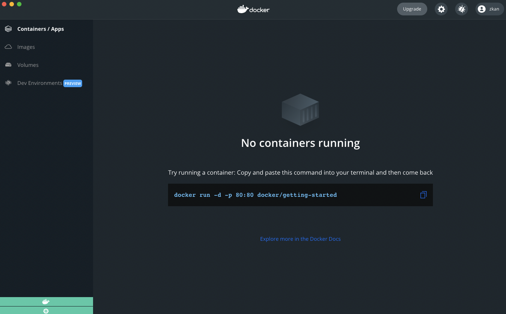
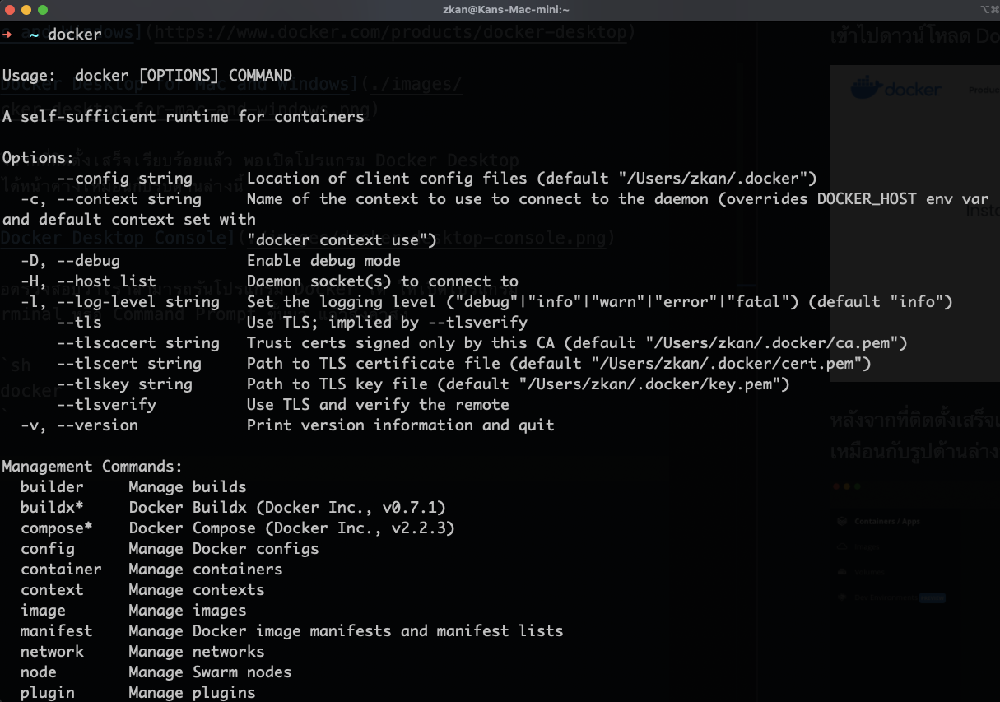

# Installing Docker Desktop

เข้าไปดาวน์โหลด Docker Desktop ที่เว็บไซต์ [Docker Desktop for Mac and Windows](https://www.docker.com/products/docker-desktop)


หลังจากที่ติดตั้งเสร็จเรียบร้อยแล้ว พอเปิดโปรแกรม Docker Desktop จะได้หน้าต่างเหมือนกับรูปด้านล่างนี้



เพื่อตรวจสอบว่าเราสามารถรันโปรแกรม Docker ได้ ให้เปิดโปรแกรม Terminal หรือ Command Prompt ขั้นมา แล้วสั่งคำสั่ง

```sh
$ docker
```

ผลที่ได้จะมีหน้าตาประมาณรูปด้านล่างนี้



ถ้าได้ตามนี้แล้วก็เป็นอันเสร็จสิ้นการติดตั้ง Docker Desktop

## References

* [Install Docker Desktop on Windows](https://docs.docker.com/desktop/windows/install/)
* [Installation of Hyper-V on windows 10 home](https://docs.microsoft.com/en-us/answers/questions/29175/installation-of-hyper-v-on-windows-10-home.html)