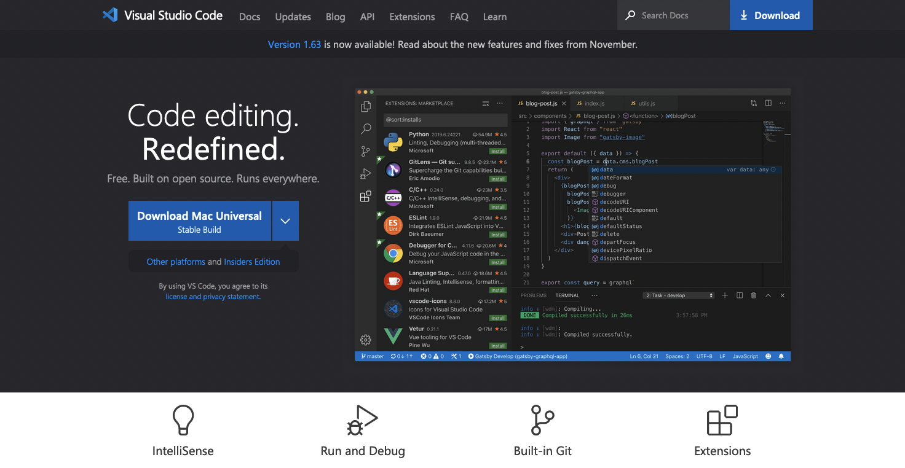
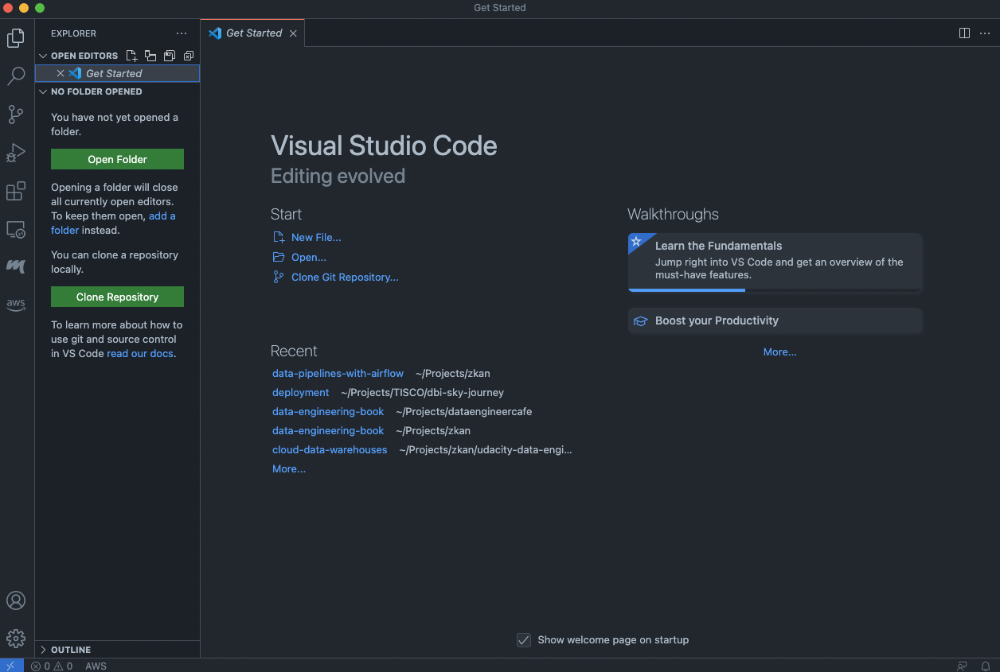

# Installing Visual Studio Code

เข้าไปดาวน์โหลดโปรแกรม Visual Studio Code ได้ที่เว็บไซต์ [Visual Studio Code - Code Editing. Refined](https://code.visualstudio.com/)

หลังจากติดตั้งเสร็จแล้ว พอเปิดโปรแกรม Visual Studio Code ขึ้นมา จะเห็นหน้าตา User Interface ประมาณนี้

เท่านี้เราก็พร้อมที่จะเขียนโค้ดพัฒนา Data Pipeline ด้วย Airflow กันแล้ว